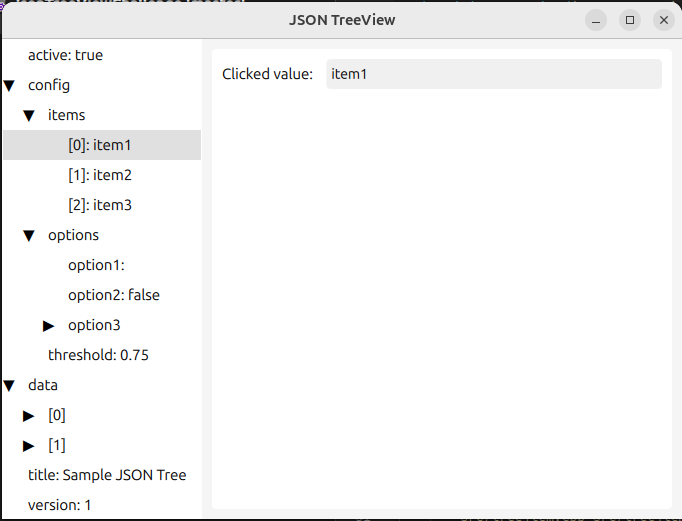

# JSON TreeView

A Qt/QML application that displays and edits JSON data in a tree structure.

### Requirements
- Qt 6.x
- CMake 3.16+
- C++17 compiler

## Usage

1. Launch the application
2. Navigate the tree structure using expand/collapse indicators
3. Edit values by:
   - Double-clicking on a leaf node
   - Modifying the value
   - Pressing Enter to save

## Requirements

- Qt 6.5.0 or higher
- Qt Creator 11.0.0 or higher

## How to Run

### Using Qt Creator

1. Open Qt Creator
2. Go to `File > Open File or Project`
3. Navigate to the project directory and select `CMakeLists.txt`
4. Click `Configure Project`
5. Select your kit (e.g., Desktop Qt 6.8.1 GCC 64bit)
6. Click the Run button (green play button) or press Ctrl+R (Cmd+R on macOS)